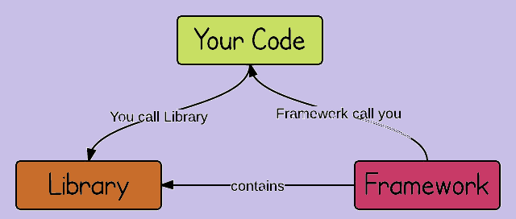
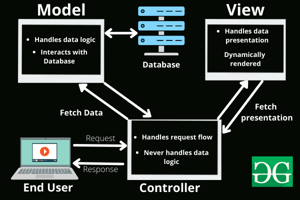

### What is Emmet ?
>*Emmet is a plug in for many popular text editors which greatly improves HTML & CSS workflow.*

You can use short expressions to generate HTML markup, CSS.
VS Code comes built-in with custom user snippets and HTML and CSS snippets and abbreviations provided by Emmet.

For example:

- type html:5 and tab
```html
<!DOCTYPE html>
<html lang="en">
<head>
    <meta charset="UTF-8">
    <meta http-equiv="X-UA-Compatible" content="IE=edge">
    <meta name="viewport" content="width=device-width, initial-scale=1.0">
    <title>Document</title>
</head>
<body>
    
</body>
</html>
```
- type div>p>span and tab 

```html
<div>
    <p>
        <span></span>
    </p>
</div>
```


###  Difference between a Library and Framework?
>*The main distinction between a framework and a library is that a framework inverts program control. It informs the developer of what they require. A library, however, does not. Instead, a programmer calls the library when and where he needs it.*




Both frameworks and libraries are code written by someone else that is used to help solve common problems.

The technical difference between a framework and library lies in a term called inversion of control. 
When you use a library, you are in charge of the flow of the application. You are choosing when and where to call the library. When you use a framework, the framework is in charge of the flow. It provides some places for you to plug in your code, but it calls the code you plugged in as needed.

Usually, a framework tells us what to do. it has the best practice of doing things and provides tooling to support us.
Examples: Angular, Vue

On the other hand, we’re the ones who lead libraries.
Examples: React, JQuery

    We can use a house as a metaphor to explain the difference between these concepts.
>Buy a house, or build your own carefully.

    A library is like building your home from scratch, you have the choice to make your house as you wish, with any architecture you like, you can sort your rooms in the way you like.

    On the other hand, Framework is like buying a new house, you don’t have to deal with building problems, but you can’t choose how to sort your rooms because the house is already built.


### What is CDN and why do we use it? 

>***CDN refers to a geographically distributed network of servers for delivering content.***
 
 

A CDN is essentially a network of geographically dispersed servers. Each CDN node (also called Edge Server) caches the static content of a site like the images, CSS/JS files and other structural components. The majority of an end-user’s page load time is spent on retrieving this content, and so it makes sense to provide these “building blocks” of a site in as many server nodes as possible, distributed throughout the world.

When a user requests your site, the node closest in proximity to user will deliver the static content, ensuring the shortest distance for the data to travel (reduced latency), therefore providing the fastest site experience   

**Benefits Of Using a CDN:**

1. **Decrease Server Load**: CDN comprises a geographically distributed network of servers for delivering content. It is not just one main server that stores the content, from client devices that retrieve data packets. This strategic placement of servers across vast distances means that any server is not in danger of being overloaded. This in turn frees up the overall capacity, serving a number of concurrent users, and brings down bandwidth and delivery costs.
    
2. **Improve Site Speed and Website Performance, improve page load time**: With CDNs, a business can deliver high-performance website content quickly by caching content on the CDN servers closest to end-users, this content can include HTML code, image files, dynamic content, and JavaScript. 
So when the end-user requests a page or content on the website, they don’t have to  wait for the request to go to the origin server. They can access the web content from the servers nearest to them, minimizing the delay for the user and improving web performance for the business through better end-user response times.
Improving site speed is also a major compontent of SEO.

3. **Reduce Packet Loss and Lower Network Latency** : When information is transmitted across devices over the internet, such as from a website to an end-user, it is done through packets. These are small units of data that contain information about the network addresses of the source and destination, error detection and correction rules, protocol identifiers and more, along with the application or website data.
If these packets have to move across large distances and devices before reaching the end-user, some may get lost along the way. They could also be delayed, which increases latency or they may arrive at the end-user in a different order than expected, also known as jitter. All of these lead to a less than optimum user experience for the end-user, especially when the content transmitted involves high-definition video, audio, or live streaming. Think of common issues such as out-of-sync audio, display distortions, choppy audio and others.

4. **Enable Advanced Website Security** : An indirect benefit of CDN services is in improving website security. Since CDNs help avoid web server overloads by distributing content across their edge servers, they can also be a powerful force against cyber attacks that rely on sending traffic spikes to key servers.
This is especially helpful in the case of DDoS attacks, where attackers aim to overwhelm an important DNS server by sending a large volume of requests. The goal is to bring this server down and along with it the website. Such downtime can inflict economic losses for a business, reputation damage, and lead to other more sinister hacks and attacks. 

5. **Contribute to Cost Savings by Reducing Bandwidth** 

6. **Increasing global availability of content**.

     
### Why do I need a CDN?

Ensuring a consistent experience for all your users is important.

A website may be hosted in a particular region, but if the majority of its users are coming from an entirely different region – e.g., if your site is hosted in North America, but if a good chunk of your users come from Europe, their speed will not be as fast as you experience it to be.

A global CDN would allow users from a European point of origin to download static content from a closer source. Instead of spanning the Atlantic ocean to retrieve data, they can connect to a server in say, London, UK, to get the same data. This reduces latency and provides a faster loading of your website.

CDNs not only ensure a faster experience to your users, but they also help to prevent site crashes in the event of traffic surges – CDNs help to distribute bandwidth across multiple servers, instead of allowing one server to handle all traffic.

### Why is React known as React?

>*React was developed for applications (Facebook) that have constantly changing data. Since React is a front-end framework or the “View” in MVC(Model-View-Controller), this means that as the user clicks around and changes the app's data, the view should “react” or change with those user events.*

Here MVC means:

***Model–view–controller*** is a software architectural pattern commonly used for developing user interfaces that divide the related program logic into three interconnected elements. This is done to separate internal representations of information from the ways information is presented to and accepted from the user.



### What is crossorigin in script tag?

The crossorigin attribute sets the mode of the request to an HTTP CORS Request. Web pages often make requests to load resources on other servers. Here is where CORS comes in. A cross-origin request is a request for a resource (e.g. style sheets, iframes, images, fonts, or scripts) from another domain.

***The purpose of crossorigin attribute*** is used to share the resources from one domain to another domain. Basically, it is used to handle the CORS request. It is used to handle the CORS request that checks whether it is safe to allow for sharing the resources from other domains.

### What is difference between React and ReactDOM ?

>*React is a javascript library, designed for building better user interfaces.*

>*React-DOM is a complimentary library to React which glues React to the browser DOM*

Whenever we use component, classes, elements, etc. We’re using React and whenever we use methods like render() or findDOMNode() we’re using React-DOM.

### Why did the React team decide to split React and React-DOM into two different libraries?

Because ***React-DOM binds the idea of React to a web browser.*** And ideally, ***React has nothing to do with a browser or web for that matter.*** That’s why we’re seeing tools and frameworks like React-Native, React-Three being developed. These tools and frameworks don’t use React-DOM, but they do in fact use the idea behind React.

### What is difference between react.development.js and react.production.js files via CDN?

 Production files are more optimized and have been minified to make user experience better.

 ### What is async and defer?
 >***Async*** - means execute code when it is downloaded and do not block DOM construction during downloading process.

 > ***Defer*** - means execute code after it's downloaded and browser finished DOM construction and rendering process.

 

#### No attributes

More often than not, a plain ```<script>``` tag without attributes is what most people tend to start with. This implements the default browser behavior. The HTML will be parsed until the script tag is encountered. At this point, HTML parsing will be paused and the script will be loaded. The script will then be executed before HTML parsing can resume.

```HTML
<script src="script.js"></script>
```
As you can see, this method can cause a long pause in HTML parsing, resulting in a degraded user experience.

#### The async attribute
To avoid a long pause in HTML parsing, the ```async``` attribute can be leveraged. This ensures that, when the script is encountered, parsing doesn't pause right away. Instead, the script is loaded in the background and only the HTML parsing is paused to execute it. HTML parsing resumes as usual after script execution is completed.
```HTML
<script src="script.js" async></script>
```
While the async attribute takes steps to mitigate the issue mentioned previously, it comes with an important caveat. Scripts loaded this way are ***not guaranteed to execute in the order specified***, but rather as they become available when they are loaded.
#### The defer attribute

Finally, the defer attribute builds on top of the previous behavior to guarantee order of execution for scripts. As previously, scripts are loaded in the background as they are encountered. When the HTML parsing finishes, ***they are then executed in order.***

```HTML
<script src="script.js" defer></script>
```

#### JavaScript code injection in an HTML document , Why put ```</script>``` tag in body not in head
>*The best practice is to put JavaScript ```<script>``` tags just before the closing ```</body>``` tag rather than in the ```<head>``` section of your HTML.*

The reason for this is that HTML loads from top to bottom. The head loads first, then the body, and then everything inside the body. If we put our JavaScript in the head section, the entire JavaScript will load before loading any of the HTML, which could cause a few problems :
- If you have code in your JavaScript that alters HTML as soon as the JavaScript code loads, there won’t actually be any HTML elements available for it to affect yet, so it will seem as though the JavaScript code isn’t working, and you may get errors.
- If you have a lot of JavaScript, it can visibly slow the loading of your page because it loads all of the JavaScript before it loads any of the HTML.

When you place your JavaScript at the bottom of your HTML body, it gives the HTML time to load before any of the JavaScript loads, which can prevent errors, and speed up website response time.