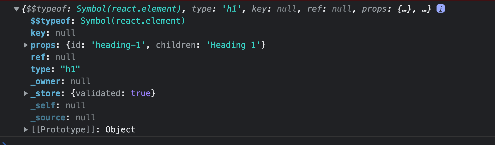
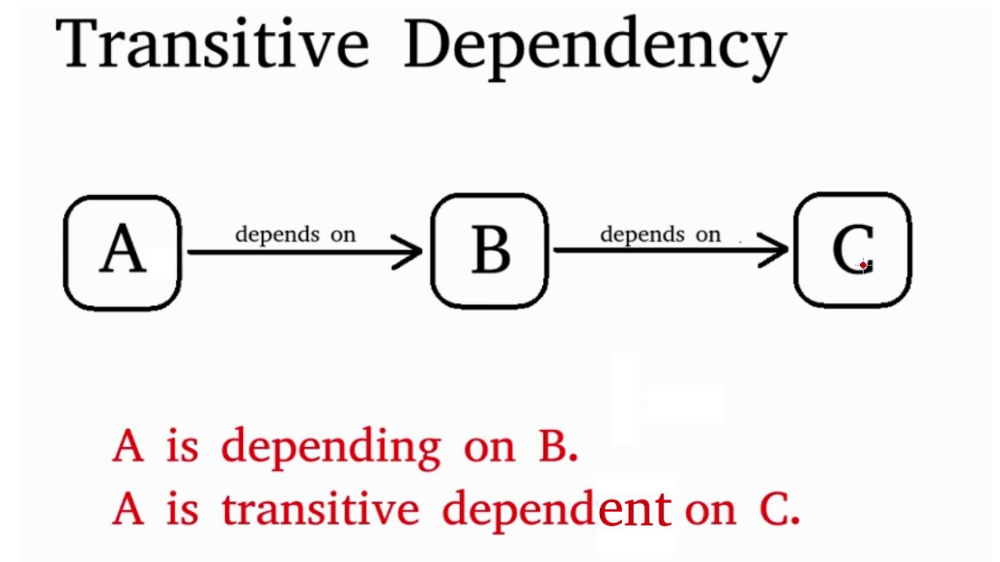

## What is JSX ? 
JSX is not HTML in javascript. `JSX is HTML like syntax.` It is more close to js than html.

`Babel convert` JSX. Babel compiles JSX down to React.createElement() calls.
```properties 
    JSX => 
    React.createElement => 
    object (element) =>
    HTML (DOM)
 ```

`NOTE`: `React doesn’t require using JSX`, but most people find it helpful as a visual aid when working with UI inside the JavaScript code.

`JSX Prevents Injection Attacks`

It is safe to embed user input in JSX:
```js
const title = response.potentiallyMaliciousInput;
// This is safe:
const element = <h1>{title}</h1>;
```

By default, React DOM escapes any values embedded in JSX before rendering them. Thus it ensures that you can never inject anything that’s not explicitly written in your application. Everything is converted to a string before being rendered. This helps `prevent XSS (cross-site-scripting) attacks`.




Here are some of the DOM elements you’ll encounter:

* `type`: Allows us to specify the type of React element to be rendered. This can either be a string (“div”, “h1”), a React component (class or function) or a React fragment.

* `props`: Can be null or an object containing properties (referred to as “props” in React) that are passed to the component.

* `children`: The children you want to be passed into that element. If this is a quoted string, as seen above, the content will be treated as text. When adding multiple children, we use an array, and we can nest as many children as we desire.

* `key`: Is used to uniquely identify elements among siblings while mapping over an array (else React will scream at you).

* `ref`: Is a reference to an actual DOM node. It allows you to get direct access to a DOM element or an instance of a component.

* `$$typeof`: This property identifies the object as a React element. It is used for protection against Cross-site Scripting (XSS) attacks.


`Ref` :  https://reactjs.org/docs/introducing-jsx.html

## Superpowers of JSX 

1. `Improved Readability`: JSX makes code easier to read and understand. It provides a clear visual distinction between HTML and JavaScript, which makes it easier for developers to spot any errors in their code. 

2. `Faster Developmen`t: JSX eliminates the need for developers to write extra code to reconcile HTML and JavaScript. This makes development faster, as developers can quickly translate their ideas into code.

3. `Greater Security`: JSX provides an extra layer of security as it is compiled into JavaScript before the browser can access it. This reduces the chances of malicious code being injected into a website.

4. `Improved Performance`: JSX compiles code into a highly optimized form, which leads to improved performance.

## Role od type attribute in script ? What options can I use there?

The type attribute is used to define the type of script, and the options available depend on the scripting language being used. Common options for this attribute include "text/javascript" for JavaScript, "text/ecmascript" for ECMAScript, "text/vbscript" for VBScript, and "application/x-perl" for Perlges such as Python may use different types.

## Transitive Dependencies
A transitive dependency exists when you have the following functional dependency pattern:



## what is babel ?

Babel is a `JavaScript compiler` that is most often used to convert ECMAScript 2015+ code into a backwards compatible version of JavaScript in current and older browsers or environments. It is also used to `convert JSX syntax into vanilla JavaScript`. Babel can be used to` transform new JavaScript syntax into older syntax`, or to transpile code from modern browsers (such as ES6) into code that runs in older browsers.

### .balelrc file 
(babel config file)
config babel plugin in this file

## What is pollyfill 

A polyfill is a piece of coding that provides support for features that may not be available in some web browsers. It is essentially a workaround that allows developers to use newer coding techniques without having to worry about browser compatibility. It is also known as a` shim or a polyfill library.`

Example : If my older browser does not under map method.
```js
Array.map() == > converted into ==>

function myMap()
```

pollyfill means we can create our own map function which works same as map()

## How can we build a performantic scalable app ?
So many things which react optimizing for us and so many which bundlers gives us. Whole application is combination of these things. and list parcel benefits.

## React Components

## functional Components 
functional Component is a normal function, it returns some sort of jsx / React element.

```js
const HeaderComponent = () =>{
    return (<div></div>)
}
```
## Component Composition
Component composition is the name for passing components as props to other components, thus creating new components with other components.

```js
// child component
const Button = ({ onClick, children }) => (
 <button onClick={onClick}>{children}</button>
);

// parent component
const App = () => {
  const onClick = () => alert('Hey 👋');

  return (
    <Button onClick={onClick}>Click me!</Button>
  );
};
```

## How can composition help prop drilling?

`Prop drilling` is the act of passing props through multiple layers of components.

Read in detail here : https://felixgerschau.com/react-component-composition/#:~:text=Component%20composition%20is%20the%20name,new%20components%20with%20other%20components.


`References :`
Babel : https://babeljs.io/
Attribute type : https://developer.mozilla.org/en-US/docs/Web/HTML/Element/script#attr-type
JS module : https://developer.mozilla.org/en-US/docs/Web/JavaScript/Guide/Modules
babel playground : https://babeljs.io/repl#
React without jsx : https://reactjs.org/docs/react-without-jsx.html