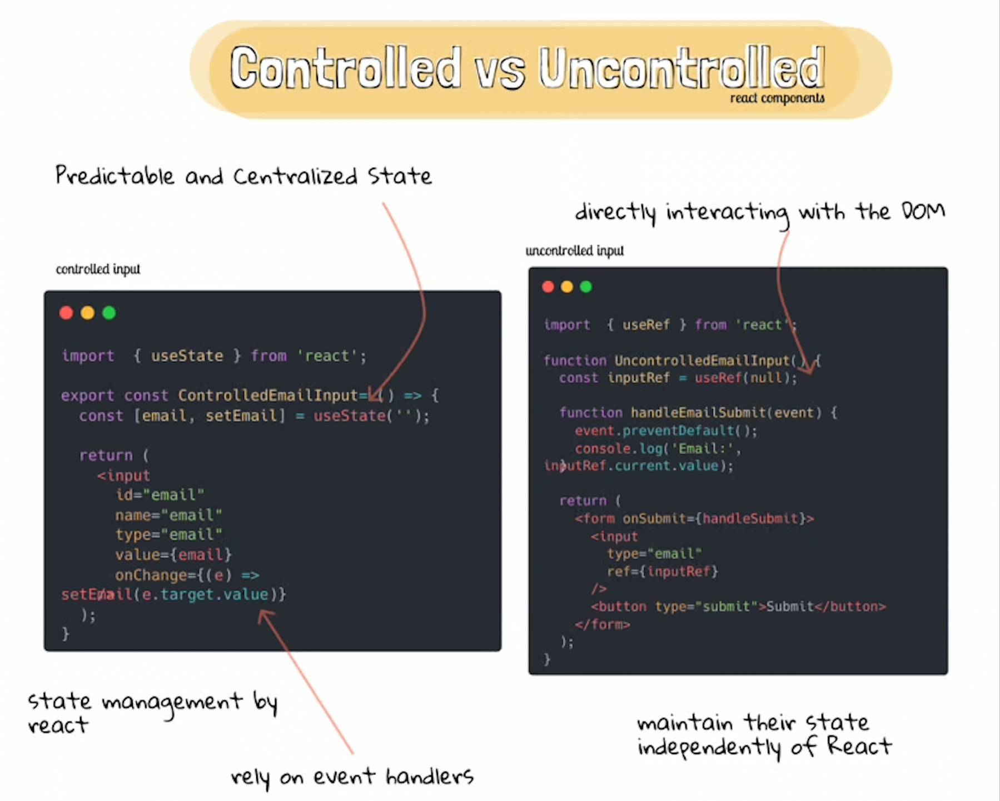
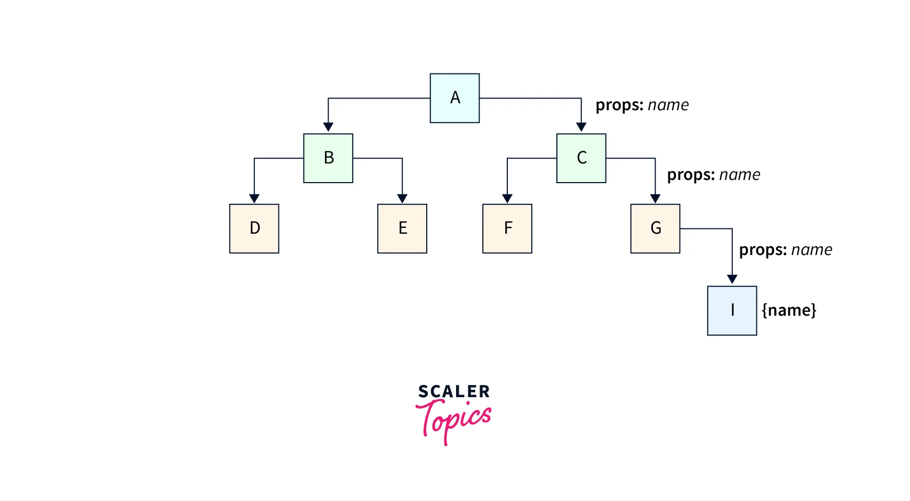

## Higher-Order Components (HOCs)
Higher-Order Components (HOCs) in React are a powerful tool for reusing code and enhancing the functionality of existing components.

A Higher-Order Component is a function that takes a component as an argument and returns a new component with additional props, behavior, or functionality. In other words, a HOC is a function that wraps around a component to enhance or modify its behavior.

#### HOCs are useful for several reasons:

1. `Code reuse`: HOCs enable you to reuse code across multiple components, reducing duplication and making your codebase more maintainable.

2. `Decoupling`: HOCs help decouple components from specific implementation details, making it easier to change or replace components without affecting other parts of the application.

3. `Flexibility`: HOCs can be used to add or remove functionality from components, making it easier to adapt to changing requirements.

4. `Readability`: HOCs can improve code readability by encapsulating complex logic and making it easier to understand the purpose of a component.

#### How to create a Higher-Order Component?

When creating HOCs, keep the following best practices in mind:

1. Keep HOCs simple and focused on a single task
2. Avoid using HOCs to modify the original component's props or state
3. Use HOCs to add new props or behavior, rather than modifying existing ones
4. Test your HOCs thoroughly to ensure they work as expected

To create a HOC, you need to define a function that takes a component as an argument and returns a new component
```jsx
import React from 'react';

const withLoadingIndicator = (WrappedComponent) => {
  const isLoading = true; // simulate loading state

  return function EnhancedComponent({ props }) {
    if (isLoading) {
      return <div>Loading...</div>;
    } else {
      return <WrappedComponent {...props} />;
    }
  };
};
```

In this example, `withLoadingIndicator` is a HOC that takes a `WrappedComponent` as an argument and returns a new component, `EnhancedComponent`. The `EnhancedComponent` checks if the `isLoading` state is true, and if so, renders a loading indicator. Otherwise, it renders the original `WrappedComponent` with the original props.

#### How to use a Higher-Order Component?

To use a HOC, you need to wrap your component with the HOC function. Here's an example:
```jsx
import React from 'react';
import withLoadingIndicator from './withLoadingIndicator';

const MyComponent = () => {
  return <div>Hello World!</div>;
};

const EnhancedMyComponent = withLoadingIndicator(MyComponent);
```
In this example, we wrap the `MyComponent` component with the `withLoadingIndicator` HOC, creating a new component, `EnhancedMyComponent`. The `EnhancedMyComponent` will now render a loading indicator if the `isLoading` state is true.


#### Common use cases for Higher-Order Components

1. `Authentication`: Use a HOC to check if a user is authenticated before rendering a component.
2. `Data fetching`: Use a HOC to fetch data from an API and pass it as props to a component.
3. `Error handling`: Use a HOC to catch and handle errors in a component.
4. `Logging`: Use a HOC to log events or data in a component.
5. `A/B testing`: Use a HOC to render different versions of a component based on user segmentation.

code of Hoc we use in our online order project. `withDiscountTagRestaurantCard` is HOC 
```jsx
const withDiscountTagRestaurantCard = (RestaurantCard) => {
    return (props) => {
        return (<div className="relative">
            <label className="absolute py-1 px-2 rounded-md left-5 bg-slate-900 text-white"> flat off 200 </label>
            <RestaurantCard {...props} />
        </div>)
    }
}

export default withDiscountTagRestaurantCard
```
How to use HOC (withDiscountTagRestaurantCard) example:
```jsx
import withDiscountTagRestaurantCard from '../utils/withDiscountTagRestaurantCard';

const Body = () => {
  const restaurant = useRestaurantList([])
  const DiscountTagRestaurantCard = withDiscountTagRestaurantCard(RestaurantCard)

  return ( <div >
      {restaurant.discountTag ?
       <DiscountTagRestaurantCard resData={restaurant} /> 
       : <RestaurantCard resData={restaurant} />}
    </div>
    )
}
```

## Controlled vs Uncontrolled Components in ReactJS

In React, `Controlled components` refer to the components where the state and behaviors are controlled by Parent components while `Uncontrolled components `are the ones having control of their own state and manage the behaviors on themselves.

#### Controlled Components
In React, `Controlled Components` is one where React controls the state of the component. This means that the component's state is managed by React itself, typically through `props`. When the state of a controlled component changes, React automatically updates the component to reflect those changes.

#### Uncontrolled Components
`Uncontrolled Components` are the components that are not controlled by the React state and are handled by the `DOM` (Document Object Model). So in order to access any value that has been entered we take the help of refs.

For instance, if we want to add a file as an input, this cannot be controlled as this depends on the browser so this is an example of an uncontrolled input.

 

## What is prop drilling?
Prop drilling refers to the process of passing props down manually through a component tree, from a parent component to a child component, and then to another child component, and so on. This can lead to a situation where props are being passed through multiple levels of components, making the code harder to read, maintain, and debug.

```jsx
// Grandparent component
function Grandparent() {
  const data = { foo: 'bar' };
  return <Parent data={data} />;
}

// Parent component
function Parent(props) {
  return <Child data={props.data} />;
}

// Child component
function Child(props) {
  return <div>{props.data.foo}</div>;
}
```
In this example, the Grandparent component passes the data prop to the Parent component, which then passes it to the Child component. This is an example of prop drilling, where the data prop is being passed through multiple levels of components.

 

#### Why is prop drilling a problem?

`Prop drilling can lead to several issues:`

1. `Tight coupling`: Components become tightly coupled, making it difficult to change one component without affecting others.
2. `Rigidity`: The component tree becomes inflexible, making it hard to add or remove components without breaking the prop chain.
3. `Debugging difficulties`: When something goes wrong, it can be challenging to identify the source of the problem, as the prop is being passed through multiple components.
4. `Code maintenance`: Prop drilling can lead to a lot of boilerplate code, making it harder to maintain and update the component tree.

#### How to avoid prop drilling?
1. `Use a State Management Library`
Consider using a state management library like Redux or MobX. These libraries provide a single source of truth for your application's state, making it easier to access and update state across components.
2. `Lift State Up`
If you don't want to use a state management library, you can lift the state up to a common ancestor component.
3. `Use Context API`
React's Context API provides a way to share state between components without passing props down manually.
4. `Keep components simple and focused`
One of the main reasons prop drilling occurs is because components are doing too much. Try to keep your components simple and focused on a single task. This will reduce the need to pass props down multiple levels.

## What is lifting the state up?

`lifting state up` is a technique used to manage state by moving it to a common ancestor component, rather than having multiple components manage their own state. This approach helps to simplify state management, reduce coupling between components, and make the code more maintainable.

#### What is the problem that lifting state up solves?

Imagine you have multiple components that need to share some state. For example, you have a `Parent` component with two child components, `ChildA` and `ChildB`, and they all need to access and update a common piece of state, such as a user's name.

`One approach would be to have each component manage its own state`

```jsx
// Parent component
function Parent() {
  return (
    <div>
      <ChildA />
      <ChildB />
    </div>
  );
}

// ChildA component
function ChildA() {
  const [userName, setUserName] = useState('');

  return (
    <div>
      <input value={userName} onChange={(e) => setUserName(e.target.value)} />
    </div>
  );
}

// ChildB component
function ChildB() {
  const [userName, setUserName] = useState('');

  return (
    <div>
      <p>Hello, {userName}!</p>
    </div>
  );
}
```
However, this approach has some issues:

1. `Duplicate state`: Each component has its own copy of the state, which can lead to inconsistencies and bugs.
2. `Tight coupling`: The components are tightly coupled, making it difficult to change one component without affecting others.

#### How does lifting state up solve these problems?

By lifting the state up, you move the state to a common ancestor component, which then passes the state down to its child components as `props`.

```jsx
// Parent component
function Parent() {
  const [userName, setUserName] = useState('');

  return (
    <div>
      <ChildA userName={userName} onUserNameChange={setUserName} />
      <ChildB userName={userName} />
    </div>
  );
}

// ChildA component
function ChildA(props) {
  return (
    <div>
      <input value={props.userName} onChange={(e) => props.onUserNameChange(e.target.value)} />
    </div>
  );
}

// ChildB component
function ChildB(props) {
  return (
    <div>
      <p>Hello, {props.userName}!</p>
    </div>
  );
}
```

By lifting the state up to the Parent component, you:

1. `Eliminate duplicate state`: There is only one source of truth for the state.
2. `Reduce coupling`: The child components are decoupled from each other and only depend on the Parent component.
3. `Simplified state management`: State is managed in a single location, making it easier to understand and debug.

By lifting state up, you can write more maintainable, scalable, and efficient React applications.

## What is Context Provider and Context Consumer?

### Context Provider
In React, a Context Provider is a component that provides a context to its child components. It is a way to `share data between components` without having to pass props down manually.

`A Context Provider is responsible for`:

1. `Storing the shared data:` The provider component holds the shared data in its state or props.
2. `Making the data available`: The provider component makes the shared data available to its child components through a context object.
3. `Updating the data`: The provider component can update the shared data, and the changes will be reflected in all child components that consume the context.

##### A Context Provider is typically created using the `React.createContext()` method, which returns an object with two properties: `Provider` and `Consumer`

Example of a Context Provider:
```jsx
import { createContext, useState } from 'react';

const ThemeContext = createContext();

const componentA = ({ children }) => {
  const [theme, setTheme] = useState('light');

  return (
    <ThemeContext.Provider value={{ theme, setTheme }}>
      {children}
    </ThemeContext.Provider>
  );
};
```
In this example, the `ThemeProvider` component provides a `theme` state and an `setTheme `function to its child components.

### Context Consumer
A Context Consumer is a component that consumes the context provided by a Context Provider. It is used to access the shared data provided by the Context Provider.

`A Context Consumer is responsible for`:

1. `Accessing the shared data`: The consumer component receives the shared data from the provider component through the context object.
2. `Using the data`: The consumer component uses the shared data to render its content or perform actions.

A Context Consumer is typically created using the `Context.Consumer` component, which is a part of the context object returned by `React.createContext()`

Example of a Context Consumer
```jsx
import React from 'react';
import { ThemeContext } from './ThemeProvider';

const Button = () => {
  return (
    <ThemeContext.Consumer>
      {({ theme }) => (
        <button style={{ backgroundColor: theme === 'dark' ? '#333' : '#fff' }}>
          Click me!
        </button>
      )}
    </ThemeContext.Consumer>
  );
};
```
In this example, the `Button` component consumes the `theme` context provided by the `ThemeProvider` component. It uses the `theme` value to style the button accordingly.

You can use the `useContext hook `to consume the context within a `functional component`:
```jsx
import {useContext} from 'react'

const MyConsumer = () => {
  const {theme} = useContext(ThemeContext)
  return  <div>{theme}</div>
}
```
The `useContext` is a hook allows you to access values from a React context in functional components. It takes a context object created by the createContext function and returns the current value of the context.

```jsx
import { createContext, useState } from 'react';

const UserContext = createContext({
    userData: {},
    setUserData: () => { },
})

const UserProvider = ({ children }) => {
    const [userData, setUserData] = useState(0);

    return (
        <UserContext.Provider value={{ userData, setUserData }}>
            {children}
        </UserContext.Provider>
    );
};

export { UserContext, UserProvider }


```


## If you don’t pass a value to the provider does it take the default value?

In React, if you don't pass a value to a Context Provider, it will use the `default value `specified in the `createContext` method.

When you create a Context using the `createContext` method, you can specify a default value as the second argument:
```jsx
const MyContext = createContext(defaultValue);
```
If you don't pass a value to the Context Provider, it will use the `defaultValue` specified when creating the Context.

For example:
```jsx
const ThemeContext = createContext('light'); // default value is 'light'

function App() {
  return (
    <ThemeContext.Provider> // no value passed
      <Toolbar />
    </ThemeContext.Provider>
  );
}
```
In this case, the `Toolbar` component will receive the default value `'light'` from the Context.

However, if you pass a value to the Context Provider, it will override the default value:
```jsx
function App() {
  return (
    <ThemeContext.Provider value="dark"> // override default value
      <Toolbar />
    </ThemeContext.Provider>
  );
}
```
In this case, the `Toolbar` component will receive the value `'dark'` from the Context.