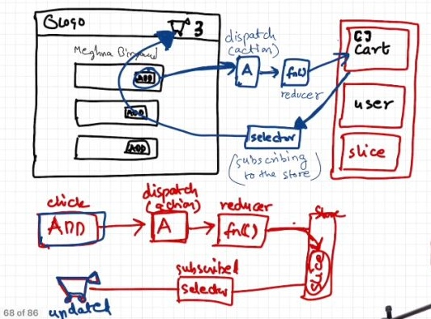

## useContext vs Redux
`useContext` and `Redux` are two popular `state management solutions` in React, but they serve different purposes and have different use cases.

### useContext
`useContext` is a React Hook that allows you to share data between components without passing props down manually.
* `How it works`: You create a context using the `createContext` function, and then use the `useContext` Hook to access the context in your components.
* `Use cases`:
    + Sharing data between components that are not parent-child related.
    + Sharing data between components that are not directly related.
    + Sharing theme or language settings across the app.
    + Managing authentication state (e.g., user login info).
* `Pros` :
    + Easy to use and set up.
    + Lightweight and simple.
    + No need to learn a new library or framework.
* `Cons` :
    + Can lead to tight coupling between components.
    + Can be difficult to debug and manage complex state flows.
    + Not suitable for large-scale applications with complex state management needs.
    
### Redux
`Redux` is a state management library that helps you manage global state by using a single source of truth.
* `How it works`: You create a store that holds the global state, and define actions, reducers, and dispatch actions to update the state.
* `Use cases`:
    + Managing complex state flows in large-scale applications.
    + Sharing data between components that are not parent-child related.
    + Handling side effects (e.g., API calls, caching).
    + Implementing undo/redo functionality.
* `Props` :
    + Predictable and debuggable state management.
    + Scalable and flexible.
    + Supports time-travel debugging.
* `Cons` :
    + Steeper learning curve.
    + Requires more boilerplate code.
    + Can be overkill for simple applications.

`Key differences` :

1. `Scope`: `useContext` is suitable for sharing data between components within a specific scope, while Redux is designed for managing global state that affects multiple components.
2. `Complexity`: `useContext` is a simple, lightweight solution, while Redux is a more complex, feature-rich state management system.
3. `Debugging`: Redux provides better debugging tools and a more predictable state management system, making it easier to debug and understand the state of your application.

`When to use each` :

* `Use useContext for`:
    + Simple, localized state management.
    + Sharing data between components that are not directly related.
* `Use Redux for`:
    + Complex, global state management.
    + Handling side effects and async actions.
    + Implementing undo/redo functionality.

In summary, `useContext` is a simple, lightweight solution for sharing data between components, while `Redux` is a more robust, feature-rich state management system for managing complex, global state. Choose the one that best fits your application's needs


## Redux vs Redux Toolkit 
#### Understanding Redux
Redux is a predictable state container for JavaScript apps. It provides a `centralized store` to manage application state. Redux uses `actions` and `reducers` to handle state changes. `Actions` are plain JavaScript objects that describe the type of change, while `reducers` specify how the state should be updated based on those actions.

`Example : Counter using Redux`

Let's take a look at a simple Redux counter implementation:

```jsx
// Action Type
const INCREMENT = 'INCREMENT';
const DECREMENT = 'DECREMENT';

// Actions
const increment = () => ({ type: INCREMENT });
const decrement = () => ({ type: DECREMENT });

// Reducer
const counterReducer = (state = 0, action) => {
  switch (action.type) {
    case INCREMENT:
      return state + 1;
    case DECREMENT:
      return state - 1;
    default:
      return state;
  }
};

// Store
const { createStore } = Redux;
const store = createStore(counterReducer);

// Dispatching Actions
store.dispatch(increment());
console.log(store.getState()); // Output: 1

store.dispatch(decrement());
console.log(store.getState()); // Output: 0s 
```

#### Introducing Redux Toolkit
While Redux is powerful, it requires writing a lot of boilerplate code to set up the store, define actions, and write reducers. Redux Toolkit is an opinionated, batteries-included package that simplifies the Redux workflow. It provides utilities that streamline common Redux tasks, such as creating actions and reducers.

`Example : Counter using Redux Toolkit`

Now, let's rewrite the previous counter example using Redux Toolkit:
```jsx
import { createSlice, configureStore } from '@reduxjs/toolkit'

// Slice
const counterSlice = createSlice({
  name: 'counter',
  initialState: 0,
  reducers: {
    increment: (state) => state + 1,
    decrement: (state) => state - 1,
  },
});

// Store
const store = configureStore({ reducer: counterSlice.reducer });

// Dispatching Actions
store.dispatch(counterSlice.actions.increment());
console.log(store.getState()); // Output: 1

store.dispatch(counterSlice.actions.decrement());
console.log(store.getState()); // Output: 0;
```
#### Advantages of Redux Toolkit
Redux Toolkit offers several advantages over plain Redux:

1. `Reduced Boilerplate`: Redux Toolkit's createSlice function automatically generates action types and action creators, reducing the amount of code you need to write.
2. `Immutability Handling`: Redux Toolkit uses the Immer library under the hood, making it easier to write immutable updates to the state.
3. `DevTools Integration`: Redux Toolkit seamlessly integrates with the Redux DevTools Extension, providing a better debugging experience.

#### When to Use Redux
While Redux Toolkit simplifies the Redux development process, there are still cases where using plain Redux might be preferable:

1. `Advanced Use Cases`: If you have complex state management needs, such as middleware, custom enhancers, or manual control over store creation, plain Redux gives you more flexibility.

2. `Existing Redux Codebase`: If you're already using Redux in your project and have an established codebase, migrating to Redux Toolkit might require more effort and may not be necessary unless you encounter specific pain points.

## Advantages of Redux Toolkit over Redux
* `Simplified Store Configuration`: Redux Toolkit simplifies the process of setting up a Redux store, eliminating the need for manual configuration of middleware, reducers, and enhancers.
* `Reduced Boilerplate Code`: Redux Toolkit reduces the amount of boilerplate code required to set up and manage state, making it easier to write and maintain code.
* `Improved Debugging`: Redux Toolkit provides automatic support for Redux DevTools Extension, making it easier to debug and monitor state changes.
* `Easier Immutable Updates`: Redux Toolkit uses the Immer library to simplify immutable updates, allowing developers to write mutable code that is automatically converted to immutable updates.
* `Built-in Support for Thunks and Async Actions`: Redux Toolkit includes built-in support for thunks and async actions, eliminating the need for additional middleware like Redux Thunk.
* `Simplified Action Creators and Reducers`: Redux Toolkit provides a simpler way to create action creators and reducers, making it easier to manage state changes.

## Get Started with Redux Toolkit

### ***How to install Redux Toolkit***
 ```
 npm install @reduxjs/toolkit react-redux
```
### 1. ***How to create a Redux store***
```jsx
//store.jsx
 import { configureStore } from '@reduxjs/toolkit'

 export const store = configureStore({
       reducer: {},
 })
 ```
This code creates a Redux store

### 2. ***How to connect the Redux Store to React***

After you've created the store, you will have to wrap your `<App/>` with a `<Provider/>` which will be imported from `react-redux`. Also the store you created above will be passed in into the provider as a prop.
```jsx
//main.js
import React from 'react'
import ReactDOM from 'react-dom'
import App from './App'
//Importing the store we created above
import { store } from "./redux/store"
//importing the provider from react-redux  
import { Provider } from 'react-redux'

ReactDOM.render(
    //This makes the store accessible to the App that is passing it as a prop
  <Provider store={store}>
    <App />
  </Provider>,
  document.getElementById('root')
)
```
### 3. ***How to create a Redux state slice***

A `Redux slice` is a concept introduced by Redux Toolkit that represents a self-contained piece of the Redux store that includes a reducer function, initial state, and action creators.

Slices provide a way to organize and modularize Redux code, making it easier to manage and maintain as your application grows. You can think of `slices as mini-Redux stores` that handle a specific piece of state within your application.

`Creating a slice requires three things`:

* `Name`, which is usually set to be a string.
* `Initial State Value`
* `Reducer`, which contains actions that define how the state can be updated.

```jsx
//countSlice.js
import { createSlice } from '@reduxjs/toolkit'

const initialState = {
  count: 0,
}

export const counterSlice = createSlice({
  name: 'counter',
  initialState,
  reducers: {
    increment: (state) => {
      state.count += 1 // state.count = state.count+1 
    },
    decrement: (state) => {
      state.count -= 1
    },
    incrementByAmount: (state, action) => {
      state.count += action.payload
    },
  },
})

// Action creators are generated for each case reducer function
export const { increment, decrement, incrementByAmount } = counterSlice.actions

export default counterSlice.reducer
```
### 4. ***How to add the slice to the store***
```jsx
//store.js
import { configureStore } from '@reduxjs/toolkit'
//Importing the reducer from countSlice
import counterReducer from "./countslice"

export const store = configureStore({
  reducer: {
    counter: counterReducer,
  },
})
```
### 5. ***How to use the state and actions in your React components***
Up until now, you've just been going through the initial set up for Redux Toolkit, setting up the store and creating the reducer. Now you need to start making use of the state and actions in your app to achieve the desired functionality.

You will be using `two hooks`: `useDispatch` and `useSelector` . `Data are being read from the store through the useSelector hook `while the `actions are being dispatched using the useDispatch hook.`

The corresponding actions (increment, decrement, and incrementByAmount) are being imported from the countSlice.js file to be used by the dispatch.

Take a look at the code below where the state is set to a variable count using the `useSelector` hook and the actions is set to a variable dispatch using the `useDispatch`. There are `three buttons`: the `increase button`, `decrease button`, and `increaseByAmount button`. An `onClick` event was placed on each button which run the various action.

`When these buttons are clicked, two things happens:`

* The Redux action is dispatched to the store.
* The slice reducer will see the action and then update the state.

```jsx
//App.jsx
import React from 'react'
import { useSelector, useDispatch } from 'react-redux'
import { decrement, increment, incrementByAmount } from "./redux/countslice"

export default function App() {
  const count = useSelector((state) => state.counter.count)
  const dispatch = useDispatch()

  return (
      <div className='App'>
        <h1>The count is {count}</h1>
        <div className="button">
        <button
          onClick={() => dispatch(increment())}
        >
          Increase
        </button>
        <button
          onClick={() => dispatch(decrement())}
        >
          Decrease
        </button>
        <button onClick={()=>dispatch(incrementByAmount(10))} > Increase by 10</button>
        </div>
      </div>
  )
}
```
 

***When you click on add button, it `dispatches an action` which calls the `reducer function` which modifies/updates  the `slice of the store` (cart) and this header component (containing the cart items) is `subscribed` to this store using a `selector` so when you add item to the cart(in body component) it will be updated in the header component as header component is subscribed to the store***


 #### Note: Never subscribe to the whole store unless u have to. Only subscribe to the specific portion of the store.
```jsx
// we are selecting the whole store  
//  updates when change in any potion of the store  
const store = useSelector((store)=>store)
const cartItems = store.cart.cartItems

// we are selecting the portion of the store .
// updates only when change in cart potion of the store  
// effective method
const cartItems = useSelector((store)=>store.cart.cartItems)
```

## Explain Dispatcher And Reducer ?
`Dispatcher` is a function that is used to send an action to the reducer.
In Redux Toolkit, the `dispatch` function is a core concept used to `send actions to the Redux store`. However, if you are referring to a Dispatcher specifically, that term isn’t used explicitly in Redux Toolkit. Instead, `dispatch` is the standard method you'll work with.

#### What is dispatch?
- `Purpose`: The `dispatch` function is used to send actions to the Redux store. `Actions` are plain JavaScript objects that describe changes or requests for changes to the state.

- `Usage`: In a Redux setup, you use `dispatch` to trigger state updates. This is done by calling `dispatch(action)`, where `action` is an object or function that Redux can process.

#### How It Fits Into Redux Toolkit
- `Configuration`: Redux Toolkit simplifies the Redux setup process. It provides functions like `createSlice` and `configureStore` to reduce boilerplate code.

- `Slices`: A slice in Redux Toolkit is a collection of reducer logic and actions for a specific part of the state. When you create a slice using `createSlice`, Redux Toolkit automatically generates action creators and reducers for you.

- `Dispatching Actions`: Once you’ve set up your slices, you can use the dispatch function to dispatch actions created by these slices.

### What is a Reducer?
In Redux Toolkit, a `reducer` is a function that determines how the state of your application changes in response to an action. Reducers specify how the application's state should be updated based on the action dispatched.

#### How Redux Toolkit Simplifies Reducers
Redux Toolkit introduces the `createSlice` function to simplify the creation of reducers. This function automatically generates action creators and action types for you, reducing boilerplate code.

#### Key Concepts in Redux Toolkit Reducers
- `createSlice`: This function from Redux Toolkit allows you to define a slice of the Redux state, along with reducers and actions related to that slice.

- `Immer Integration`: Redux Toolkit uses the `immer library` internally, which allows you to write reducers in a more intuitive way. With `immer`, you can write `"mutative"` code inside reducers, but it safely handles immutability for you.

### Example:
Here’s a basic example illustrating how to use `dispatch` and how to define and use `reducers` with Redux Toolkit:

1. *`Create a Slice :`*

```jsx
//counterSlice.js
import { createSlice } from '@reduxjs/toolkit';

// Create a slice of the state
const counterSlice = createSlice({
  name: 'counter', // Name of the slice
  initialState: { value: 0 }, // Define the initial state

  // Reducer to handle incrementing the count
  reducers: {
    increment: (state) => {
      state.value += 1; //// Immer allows us to "mutate" state directly
    },
     // Reducer to handle decrementing the count
    decrement: (state) => {
      state.value -= 1;
    },
  },
});
// Export actions generated by createSlice
export const { increment, decrement } = counterSlice.actions;

// Export the reducer to be used in the store
export default counterSlice.reducer;
```
- 1. `counterSlice`: A slice of the store that contains the reducer and action creators for the counter.
- 2. `counterReducer`: The reducer function for the counter slice.
- 3. `increment` and `decrement`: Action creators for the counter slice.
- 4. `name`: A string representing the name of the slice. This is used as a prefix for action types.
- 5. `initialState`: The initial state for this slice of the store.
- 6. `reducers`: An object where each key corresponds to a reducer function. These reducers handle state changes based on dispatched actions.


2. *`Configure the Store:`*
```jsx
//store.js 
import { configureStore } from '@reduxjs/toolkit';
import counterReducer from './counterSlice'; // Import the reducer from the slice

// Configure the Redux store
const store = configureStore({
  reducer: {
    counter: counterReducer, // Add the slice reducer to the store
  },
});

export default store;
```
- 1. `configureStore`: A function from `@reduxjs/toolkit` that helps you create a store with a reducer.
- 2. `Store`: The central location that holds the state and dispatches actions.

3. *`Dispatching Actions:`*
```jsx
// Counter.js
import React from 'react';
import { useDispatch, useSelector } from 'react-redux';
import { increment, decrement } from './counterSlice';

function Counter() {
  const dispatch = useDispatch();
  const count = useSelector((state) => state.counter.value);

  return (
    <div>
      <p>Count: {count}</p>
      <button onClick={() => dispatch(increment())}>Increment</button>
      <button onClick={() => dispatch(decrement())}>Decrement</button>
    </div>
  );
}

export default Counter;
```
- 1. `useDispatch` and `useSelector`: Hooks that help you interact with the store in your components.

#### Key Points
*  `dispatch`: The function you call to send actions to the Redux store.
* `createSlice`: A Redux Toolkit utility that simplifies the creation of reducers and actions.
* `Reducers`: Functions that handle actions and update the state accordingly.
* `Immer`: Integrated in Redux Toolkit, allowing for direct state mutations while ensuring immutability.

So, while `dispatch` is the primary function for sending actions, it integrates with Redux Toolkit’s streamlined approach to managing state and actions, providing a more efficient and developer-friendly experience.

#### Key Benefits of Using createSlice and Redux Toolkit
- `Reduced Boilerplate`: createSlice automatically generates action creators and action types based on the reducer functions you define. This reduces the amount of boilerplate code compared to traditional Redux.

- `Simplified Immutability`: With `immer`, you can write code that looks like it’s mutating the state directly. `immer` handles the complexity of immutability behind the scenes, making your reducers easier to read and write.

- `Automatic Action Types`: Action types are automatically generated and prefixed with the slice name, reducing the risk of typos and improving consistency.

- `Integrated Development Tools`: Redux Toolkit’s configureStore integrates with Redux DevTools out of the box, making debugging easier.


## What is a Slice?
A `slice` represents a portion of the Redux state along with the reducers and actions that manage that portion. It encapsulates:

1. `State`: The `initial state` for that slice of the store.
2. `Reducers`: Functions that handle actions and update the state based on the action type.
3. `Actions`: Action creators that are automatically generated based on the reducer functions.

### Benefits of Using Slices
- `Reduced Boilerplate`: createSlice simplifies the creation of reducers and actions, reducing the amount of boilerplate code needed.

- `Integrated Actions and Reducers`: Actions and reducers are defined together, making it easier to manage and understand the state changes related to a specific part of the application.

- `Automatic Action Creators`: Action creators are automatically generated for each reducer function, reducing the likelihood of errors and typos.

- `Enhanced Readability`: Combining state, actions, and reducers in one place improves the readability and maintainability of your code.

- `Immer Integration`: Redux Toolkit’s use of immer allows you to write reducers that look like they’re `mutating state directly`, while actually preserving immutability.


## What is a Selector?
A selector is a function that takes the entire state of the Redux store as an argument and returns a specific part of the state or derived data. Selectors can also be memoized to optimize performance.

#### Basic Example of a Selector
Consider a Redux store with a slice for managing a counter:

1. *`Define the Slice:`*
```jsx
import { createSlice } from '@reduxjs/toolkit';

const counterSlice = createSlice({
  name: 'counter',
  initialState: {
    count: 0,
    incrementAmount: 1,
  },
  reducers: {
    increment: (state) => {
      state.count += state.incrementAmount;
    },
    decrement: (state) => {
      state.count -= state.incrementAmount;
    },
    setIncrementAmount: (state, action) => {
      state.incrementAmount = action.payload;
    },
  },
});

export const { increment, decrement, setIncrementAmount } = counterSlice.actions;
export default counterSlice.reducer;
```
2. *`Create a Basic Selector:`*
```jsx
// Selector to get the count value from the state
export const selectCount = (state) => state.counter.count;

// Selector to get the increment amount from the state
export const selectIncrementAmount = (state) => state.counter.incrementAmount;
```
3. *`Use the Selector in a Component:`*
```jsx
import React from 'react';
import { useDispatch, useSelector } from 'react-redux';
import { increment, decrement, setIncrementAmount, selectCount, selectIncrementAmount } from './counterSlice';

function Counter() {
  const dispatch = useDispatch();
  const count = useSelector(selectCount); // Use the selector to get the count
  const incrementAmount = useSelector(selectIncrementAmount); // Use the selector to get the increment amount

  return (
    <div>
      <p>Count: {count}</p>
      <p>Increment Amount: {incrementAmount}</p>
      <button onClick={() => dispatch(increment())}>Increment</button>
      <button onClick={() => dispatch(decrement())}>Decrement</button>
      <button onClick={() => dispatch(setIncrementAmount(5))}>Set Increment Amount to 5</button>
    </div>
  );
}

export default Counter;
```
#### Diagram of Redux State and Selectors showing the Redux state and how selectors interact with it.
```Iua
+----------------------+
|        Redux Store   |
+----------------------+
|                      |
|  +----------------+  |
|  |   counter      |  |
|  +----------------+  |
|  | count: 0       |  |
|  | incrementAmount: 1|  
|  +----------------+  |
|                      |
+----------------------+

       | | |            Selectors
       | | |             
       V V V              
+--------------------------+
|      selectCount         |
+--------------------------+
|  (state) => state.counter.count  |
+--------------------------+

+--------------------------+
| selectIncrementAmount    |
+--------------------------+
|  (state) => state.counter.incrementAmount |
+--------------------------+
```

#### Advanced Example with Memoization
For more complex scenarios, you can use the `reselect` `library` to create memoized selectors. Memoization helps avoid unnecessary recalculations by caching results based on the input values.
Redux Toolkit does not include memoization directly, but it integrates well with the `reselect` library, which provides utilities `for creating memoized selectors.`

1. `Install reselect (if not already installed):`
```bash
npm install reselect
```
2. `Define the Redux Slice:`

First, let’s define a slice of state using `createSlice`. For this example, we’ll create a slice that manages a list of `items` and a `filter`.
```jsx
import { createSlice } from '@reduxjs/toolkit';

// Define the initial state for the slice
const initialState = {
  items: [],       // Array to store items
  filter: ''       // Filter string for searching items
};

// Create a slice of the state
const itemsSlice = createSlice({
  name: 'items',
  initialState,
  reducers: {
    addItem: (state, action) => {
      state.items.push(action.payload); // Add a new item to the list
    },
    setFilter: (state, action) => {
      state.filter = action.payload; // Set the filter string
    }
  }
});

// Export actions for use in components
export const { addItem, setFilter } = itemsSlice.actions;

// Export the reducer to be used in the store
export default itemsSlice.reducer;
```
3. `Create Memoized Selectors:`

Use the `createSelector` function from `reselect` to create memoized selectors.
```jsx
import { createSelector } from 'reselect';

// Basic selector to get the list of items
const selectItems = (state) => state.items.items;

// Basic selector to get the filter string
const selectFilter = (state) => state.items.filter;

// Memoized selector to filter items based on the filter string
export const selectFilteredItems = createSelector(
  [selectItems, selectFilter], // Input selectors
  (items, filter) => {
    // Return filtered items based on the filter string
    return items.filter(item => item.toLowerCase().includes(filter.toLowerCase()));
  }
);
```
- `selectItems:` A basic selector to extract the `items` array from the state.
- `selectFilter:` A basic selector to extract the `filter` string from the state.
- `selectFilteredItems:` A memoized selector created using `createSelector`. It takes the `items` and `filter` as inputs and returns the filtered list of items.

4. `Use Memoized Selectors in a Component:`
```jsx
import React from 'react';
import { useDispatch, useSelector } from 'react-redux';
import { addItem, setFilter, selectFilteredItems } from './itemsSlice';

function ItemList() {
  const dispatch = useDispatch();
  const filteredItems = useSelector(selectFilteredItems); // Use the memoized selector

  // Handler to add an item
  const handleAddItem = (item) => {
    dispatch(addItem(item));
  };

  // Handler to set the filter
  const handleFilterChange = (event) => {
    dispatch(setFilter(event.target.value));
  };

  return (
    <div>
      <input 
        type="text" 
        placeholder="Filter items" 
        onChange={handleFilterChange} 
      />
      <ul>
        {filteredItems.map((item, index) => (
          <li key={index}>{item}</li>
        ))}
      </ul>
      <button onClick={() => handleAddItem('New Item')}>Add Item</button>
    </div>
  );
}

export default ItemList;
```
- `useSelector:` The `selectFilteredItems` selector is used to get the filtered list of items. Because it is memoized, it will only recompute when the `items` or `filter` changes.
- `handleAddItem:` Dispatches the `addItem` action to add a new item to the list.
- `handleFilterChange:` Dispatches the `setFilter` action to update the filter string.

#### Explaining the Code
- `Basic Selectors: `Extract specific parts of the state (`items` and `filter`) to be used by other functions.
- `Memoized Selector (selectFilteredItems):`
  - `Input Selectors:` `selectItems` and `selectFilter` are input selectors that provide data to the memoized selector.
  - `Output Function:` The function (`items`, `filter`) => ... computes derived data (filtered items) based on the inputs. It only re-runs when the items or `filter` change, thanks to `memoization`.
- `Component Usage`: `useSelector` is used to access the memoized selector, which optimizes performance by preventing unnecessary re-computations and re-renders.

#### Diagram of Memoized Selector how memoized selectors work:
```
+------------------+
|    Redux State   |
+------------------+
|   items: [A, B, C]|
|   filter: 'b'    |
+------------------+
        |
        | 
        V
+------------------+          +---------------------------+
|  selectItems     |          |  selectFilter             |
|  (state) =>      |          |  (state) =>               |
|  state.items     |          |  state.filter             |
+------------------+          +---------------------------+
        |
        |      
        V
+-----------------------------+
|   selectFilteredItems       |
|   createSelector([          |
|     selectItems,            |
|     selectFilter],          |
|   (items, filter) =>        |
|   items.filter(item =>      |
|   item.toLowerCase()        |
|   .includes(filter.toLowerCase()))|
+-----------------------------+
        |
        |
        V
+-------------------+
|   Component       |
|   (filteredItems) |
+-------------------+
```
