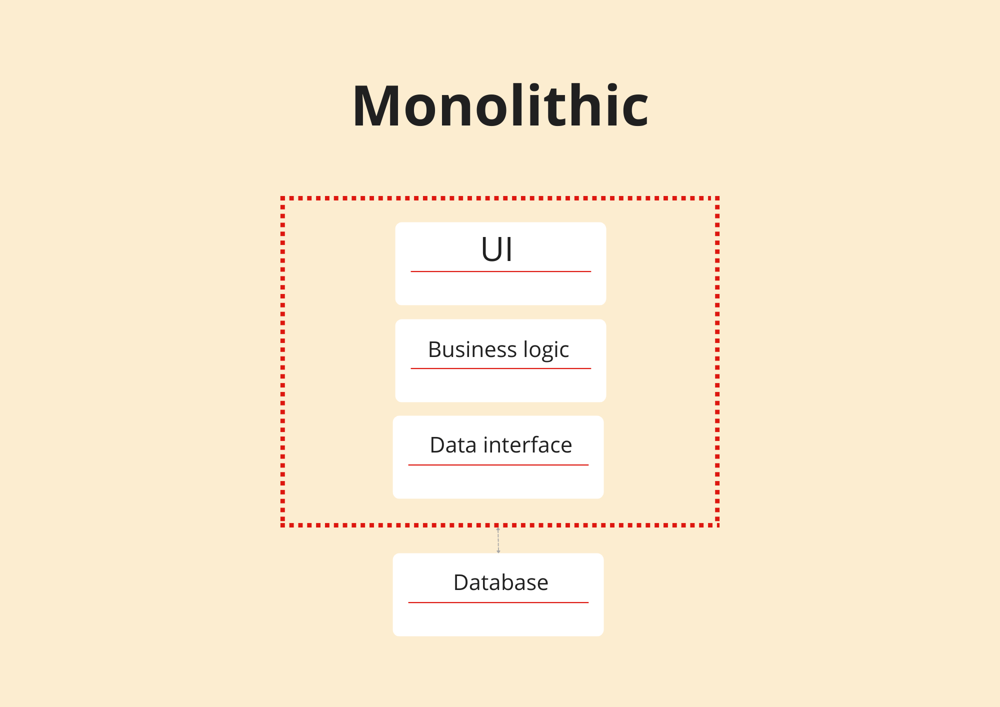
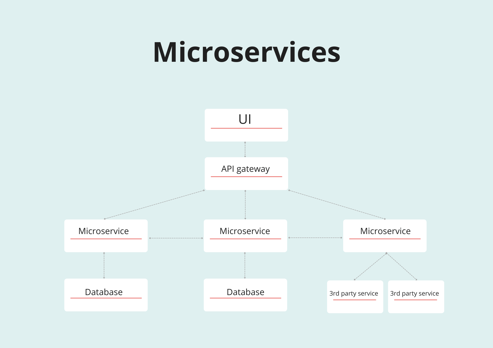
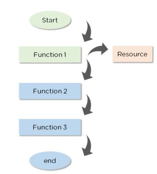
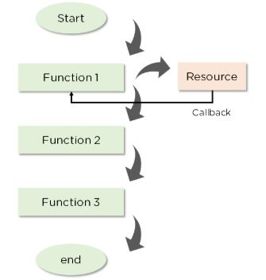

## What is difference between monolith and microservice ?

 A `monolithic` application is one large application with a single codebase, built and deployed as a single unit. It typically contains all the components of a system, including UI, business logic, and data access code.



`Microservices` architecture is an industry-proven method of building applications out of separate distributed modules (microservices) each focused on one business function or service. These modules use APIs (often RESTful) and API gateways to connect with other services, client apps, and other applications in the organization. The API-driven approach enables loose connections and weak dependence between components.

Each module in a microservices application has its own business logic, database, and often an individual tech stack that can be completely different from the rest of the system. As a result, you can deploy and scale microservices independently



## Why do we need useEffect hook ?

The useEffect hook is a React hook that allows you to perform side effects in function components. It serves the same purpose as componentDidMount, componentDidUpdate, and componentWillUnmount in React classes, but unified into a single API. It allows developers to perform data fetching, set up subscriptions, or manually change the DOM in response to component changes. It can also help with performance by preventing unnecessary re-renders. 

`useEffect accepts two arguments`. The second argument is optional.

useEffect(`<function>`, `<dependency>`)

```js
useEffect(() => {
  //Runs on every render
});

useEffect(() => {
  //Runs only on the first render
}, []);
useEffect(() => {
  //Runs on the first render
  //And any time any dependency value changes
}, [prop, state]);
```

## What is Optional chaining (?.)

The `optional chaining (?.)` operator accesses an object's property or calls a function. If the object accessed or function called is `undefined or null`, it `returns undefined instead of throwing an error.`

```js
// without optional chaining 
const nestedProp = obj.first && obj.first.second;

// with optional chaining 
const nestedProp = obj.first?.second;

// this is same as following 
const temp = obj.first;
const nestedProp =
  temp === null || temp === undefined ? undefined : temp.second;
```

## What is Shimmer UI ?
Shimmer is a `temporary animation placeholder` for when a service call takes time to return data and we don't want to block rendering the rest of the UI.

## Difference between expression and statement 
### expression
At its core, an `expression` is a bit of JavaScript code that `produces a value`.
For example, these are all expressions:

```js 
 1 → produces 1

 "hello" → produces "hello"

 5 * 10 → produces 50

 num > 100 → produces either true or false

 isHappy ? "🙂" : "🙁" → produces an emoji

 [1, 2, 3].pop() → produces the number 3
```

Expressions can contain expressions.

```js
(5 + 1) * 2 
```
### Statement 
A JavaScript program is a sequence of `statements`. Each statement is an instruction for the computer to do something.

Here are some examples of statements in JavaScript:

```js
let hi = 5;

if (hi > 10) {
  // More statements here
}

throw new Error('Something exploded!');

function add(a, b) { return a + b; }

if (true) { console.log('Hi'); }
```

## What is conditional rendering ?
In React, conditional rendering refers to the `process of delivering elements and components based on certain conditions.`

example:

`condition ? true : false.`
```js
{showHeader ? <Header> : null}
```

It works because in JavaScript, `true && expression always evaluates to expression`, and `false && expression always evaluates to false`.

Therefore, if the condition is true, the element right after && will appear in the render. `If it is false, React will ignore and skip it.`
```js
render(){
 {unreadMessages.length > 0 &&
        <h2>
          {unreadMessages.length}
        </h2>
      }
}
```
Note that returning a falsy expression will still cause the element after && to be skipped but will return the falsy expression. In the example below, `<div>0</div>` will be returned by the render method.

```js 
render() {
  const count = 0;
  return (
    <div>
      {count && <h1>Messages: {count}</h1>}
    </div>
  );
}
```

## What is CORS? 
CORS (Cross-Origin Resource Sharing) is a security feature 
known as the `Same-Origin Policy (SOP)`.implemented in web browsers to prevent web pages from making requests to a different origin (domain, protocol, or port) than the one the web page was loaded from. This is done to prevent malicious scripts from making unauthorized requests on behalf of the user.


When a browser makes a cross-origin request (e.g., a web app requesting a server in a different domain), the browser adds a Origin header to the request. The server can then check this Origin against its CORS policy. If the origin is permitted, the server adds a Access-Control-Allow-Origin header to the response indicating which origins are allowed. The browser then allows the web app to access the server's response.

We can deal with CORS issues on the backend. Cross-origin requests require that the values for origin and Access-Control-Allow-Origin in the response headers match, and the server sets it. When you add an origin to the backend code, the CORS middleware only permits this URL to communicate with other origins and utilize it for cross-origin resource requests.

`There are two ways to fix CORS issues:`

1. Configure the backend to Allow CORS. A server can let all domains with Access-Control-Allow-Origin: *. This turns off the same-origin policy, which is not recommended. Another option would be only to allow a particular domain, e.g., Access-Control-Allow-Origin: https://somedomain.com.

2. Use a Proxy Server. We can use a proxy server to call external API. It acts as a middleware between the client and the server. If a server doesn’t return proper headers defined by CORS, we can add them to the proxy.

## What is async and await?

#### Firstly lets understand what is Synchronous Programming  & Asynchronous Programming 

`Synchronous programming` includes the sequential execution of functions and processes. If a particular function needs a resource, `execution stops until` the currently executing function fetches the resource and finishes its process.




`Asynchronous programming`, on the other hand, ensures that the `execution does not stop` if a function is performing other operations. Instead, the execution continues normally until the function is called back again. `To facilitate this, concepts like Callbacks, Promises, and Async/await are used. `




`Async and await `are built on promises. The keyword `“async” accompanies the function, indicating that it returns a promise`. Within this function, the await keyword is applied to the promise being returned. `The await keyword ensures that the function waits for the promise to resolve.` On the surface, the execution looks synchronous, but it is asynchronous. The function’s execution is blocked at the await keyword’s placement in the coding. Async functions make the code more readable and are easier to handle than promises. `The keyword await makes JavaScript wait until that promise settles and returns its result.`

```js
async function function_name(){
  await some_promise()
}
```

```js
async function f() {

  let promise = new Promise((resolve, reject) => {
    setTimeout(() => resolve("done!"), 1000)
  });

  let result = await promise; // wait until the promise resolves (*)

  alert(result); // "done!"
}

f();
```
The function execution “pauses” at the line (*) and resumes when the promise settles, with result becoming its result. So the code above shows “done!” in one second.

Let’s emphasize: await literally suspends the function execution until the promise settles, and then resumes it with the promise result. That doesn’t cost any CPU resources, because the JavaScript engine can do other jobs in the meantime: execute other scripts, handle events, etc.
