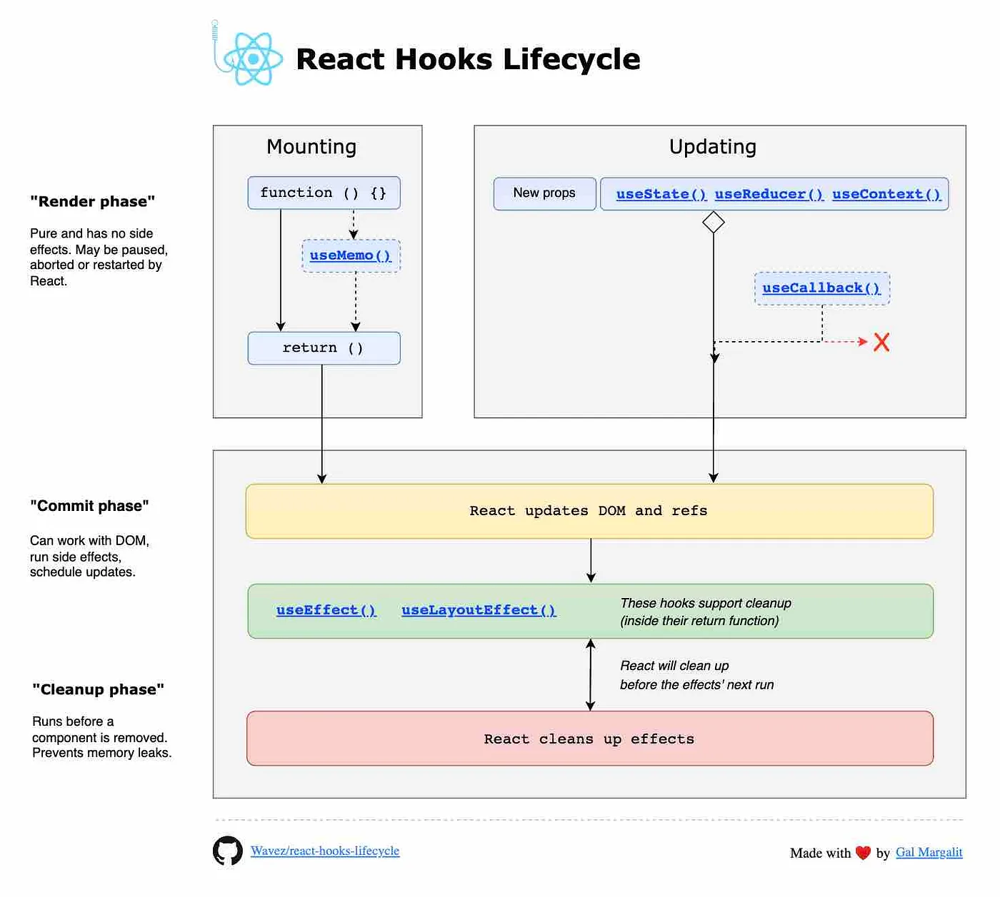
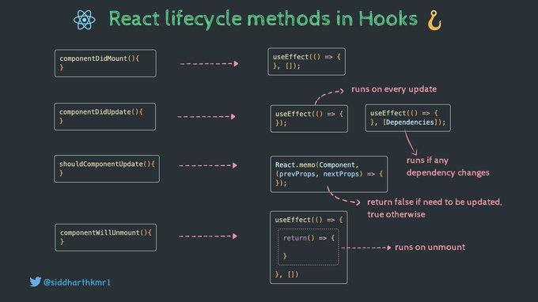

## How do you create Nested Routes react-router-dom cofiguration ?

Let's say you have a layout like this:
```md
* Home
* About
	+ Team
    + Mission
* Contact
```

You want to create nested routes for the About section, so that `/about` and `/about/team` are separate routes.

Here's an example configuration using react-router-dom v6:

```jsx
import { BrowserRouter, Routes, Route } from 'react-router-dom';

function App() {
  return (
    <BrowserRouter>
      <Routes>
        <Route path="/" element={<Home />} />
        <Route path="about" element={<About />}>
          <Route path="team" element={<Team />} />
          <Route path="mission" element={<Mission />} />
        </Route>
        <Route path="contact" element={<Contact />} />
      </Routes>
    </BrowserRouter>
  );
}
```
In this example, we define a route for` /about` and then nest two child routes underneath it: `/about/team` and `/about/mission`. The `element` prop is used to render the corresponding component for each route.

When the user navigates to `/about/team`, the `Team` component will be rendered inside the `About` component.

Also, make sure to use the `Outlet` component in your parent component (`About `in this case) to render the child routes:

```jsx
import { Outlet } from 'react-router-dom';

function About() {
  return (
    <div>
      <h1>About</h1>
      <Outlet />
    </div>
  );
}
```
This will render the child routes (`Team` and `Mission`) inside the `About` component.


## Exploring the Core Concepts of Routing in React Applications
React Router is a standard library for routing in React apps. It enables the navigation between different components in a single page application, without the need for a full page reload. This client side routing approach helps maintain a seamless user experience, akin to that of a traditional multi-page website.

`The Significance of the React Router DOM Package`

The `react-router-dom` package extends React Router with bindings for web applications. It provides router components like `BrowserRouter`, `HashRouter` and `MemoryRouter`, which are essential for adding navigation functionality to your React app. These components sync the UI with the current URL, making it possible to bookmark and share URLs.

#### `Diving Deep into BrowserRouter: When and Why to Use It`
`How Does BrowserRouter Leverage the History API?`
BrowserRouter is a router implementation that uses the `HTML5 history API` to keep your UI in sync with the URL. By utilizing the History API, the browser router manages clean routes without the hash character, making the URLs more readable and SEO-friendly.

To maintain clean routes in a client side react application, `BrowserRouter requires server side configuration.` This ensures that all requests sent to the server return the same HTML file, regardless of the current route, allowing the React app to handle the routing.

#### `HashRouter Explained: Understanding Its Mechanism and Usage`

`How HashRouter Utilizes the Hash Portion of the URL`

HashRouter uses the` hash portion of the URL` (the part following the hash symbol) to keep your UI in sync with the URL. It’s a client-side routing method that doesn’t require any server-side configuration, as the hash value is never sent to the server. Implementing a hash router is straightforward and visually different from BrowserRouter, as it includes the hash symbol in the URL, making it `suitable for legacy browsers` and single-page applications.

HashRouter is particularly useful when you have a static file server and cannot configure the server to handle dynamic routes. It’s also beneficial when you need to support legacy browsers that do not support the history API, making the hash router an ideal choice for single-page applications.


#### The Technical Distinction Between BrowserRouter and HashRouter
The main difference between browser router and hash router lies in how they handle the URL and interact with the web server. Browser router utilizes the History API to manipulate the browser history with JavaScript, creating clean URLs without the hash character, and requires server configuration to respond to specific routes. In contrast, hash router uses the hash portion of the URL to manage route changes, making it suitable for legacy browsers and single-page applications, but it has limitations for SEO.

`HashRouter is not recommended for modern web applications` because it does not support server side rendering and can lead to hash routing, which is not as clean or user-friendly as the routes provided by BrowserRouter. Furthermore, the hash router can cause issues with SEO, as search engines might ignore the hash portion of the URL.

#### MemoryRouter

MemoryRouter is a type of router provided by React Router that manages routing internally within a React application without manipulating the browser's URL

`MemoryRouter` is another alternative within the React Router library that is useful for non-browser environments. It keeps the history of your routes in memory (not in the URL), making it a good option for tests and environments where you don't need to maintain a history stack.

####  What is the order of life cycle method calls in Class Based Components

```jsx
import React, { Component } from 'react';

class LifecycleExample extends Component {
  constructor(props) {
    super(props);
    console.log('1. constructor');
  }

  render() {
    console.log('2. render');
    return <div>Lifecycle Example</div>;
  }

  componentDidMount() {
    console.log('3. componentDidMount');
  }

  componentDidUpdate() {
    console.log('4. componentDidUpdate');
  }

  componentWillUnmount() {
    console.log('5. componentWillUnmount');
  }
}
```
When you run this example, you'll see the following output in the console:

`Mounting phase`

```js
1. constructor
2. render
3. componentDidMount
```
`Updating phase`

When you update the component's props, you'll see
```js
2. render
4. componentDidUpdate
```
`Unmounting phase`

And when you unmount the component, you'll see:
```js
5. componentWillUnmount
```


fig:1 Diagram showing Class Based component life cycle methods 


fig:2 Diagram showing Class Based component life cycle methods (older version)


fig:3 Diagram showing hooks/ functionally life cycle methods 


fig:4 Diagram showing comparison between life cycle methods of class based life cycle methods and functionally life cycle methods 

## Why do we use componentDidMount?
`componentDidMount` is a lifecycle method in React that is called after a component has been rendered to the DOM. It's a crucial method that allows you to execute code after the component has been mounted.

#### Common Use Cases:

1. `API Calls`: You can use `componentDidMount` to make API calls to fetch data from a server. This ensures that the data is fetched after the component has been rendered.
2. `DOM Manipulation`: If you need to manipulate the DOM after the component has been rendered, `componentDidMount` is the perfect place to do so. `componentDidMount` can be used to update the DOM directly, such as setting the focus on an input field or scrolling to a specific element.
3. `Setting up Event Listeners`: You can use `componentDidMount` to set up event listeners for DOM events, such as clicks or scrolls.
4. `Integrate with Other Libraries:``componentDidMount` can be used to integrate React with other libraries, such as Google Maps or Facebook SDKs, which require the component to be mounted in the DOM.

```jsx
import React, { Component } from 'react';

class ExampleComponent extends Component {
  componentDidMount() {
    // Make an API call to fetch data
    fetch('https://api.example.com/data')
      .then(response => response.json())
      .then(data => this.setState({ data }));

    // Set up an event listener
    document.addEventListener('click', () => console.log('Clicked!'));
  }

  render() {
    return (
      <div>
        <h1>Example Component</h1>
      </div>
    );
  }
}
```

## Why do we use componentWillUnmount? Show with example

`componentWillUnmount` is a lifecycle method in React that is called just before a component is removed from the DOM. Here are some reasons why we use `componentWillUnmount`:

1. `Clean Up Resources:`
`componentWillUnmount` is used to clean up resources, such as event listeners, timers, or WebSocket connections, that were set up in `componentDidMount`. This prevents memory leaks and ensures that the component is properly cleaned up.

2. `Remove Event Listeners:`
`componentWillUnmount` is used to remove event listeners that were set up in `componentDidMount`. This prevents the component from responding to events after it has been removed from the DOM.

3. `Cancel Pending Requests:`
`componentWillUnmount` can be used to `cancel API requests` that were made in `componentDidMount`. This prevents the component from receiving data after it has been removed from the DOM.

```jsx
import React, { Component } from 'react';

class ExampleComponent extends Component {
  constructor(props) {
    super(props);
    this.state = { data: [] };
    this.timerId = null;
  }

  componentDidMount() {
    // Set up a timer
    this.timerId = setInterval(() => console.log('Timer ticked!'), 1000);

    // Set up an event listener
    document.addEventListener('click', () => console.log('Clicked!'));

    // Make an API call
    fetch('https://api.example.com/data')
      .then(response => response.json())
      .then(data => this.setState({ data }));
  }

  componentWillUnmount() {
    // Clean up resources
    clearInterval(this.timerId);
    document.removeEventListener('click', () => console.log('Clicked!'));

    // Cancel API request
    if (this.apiRequest) {
      this.apiRequest.cancel();
    }
  }

  render() {
    return (
      <div>
        <h1>Example Component</h1>
        <ul>
          {this.state.data.map(item => (
            <li key={item.id}>{item.name}</li>
          ))}
        </ul>
      </div>
    );
  }
}
```

In this example, `componentWillUnmount` is used to:

* Clean up the timer using `clearInterval`
* Remove the event listener using `removeEventListener`
* Cancel the API request using `cancel`
By using `componentWillUnmount` effectively, you can ensure that your React components are properly cleaned up and resources are released when the component is removed from the DOM.

##  Why do we use super(props) in constructor?
In React, when you create a class component, you need to call the `super()` method in the constructor to inherit the properties and behavior of the parent class (`React.Component`).
 
##### But why do we pass props to `super()`?
In React, when you create a component, it inherits from the `React.Component` class. When you call `super()` in your component's constructor, you're essentially calling the constructor of the parent class (`React.Component`).

Passing `props` to `super()` allows the parent class to initialize the component's props, which is necessary for the component to receive and use props passed from its parent.

```jsx
class MyComponent extends React.Component {
  constructor(props) {
    super(props);  // Initialize state, bind methods, etc.
    this.state = { name: props.name };
  }

  render() {
    return <div>Hello, {this.state.name}!</div>;
  }
}
```

when you create a component that extends another component, you need to call `super` in the constructor to inherit the properties and behavior of the parent component.
```jsx
import React, { Component } from 'react';

class ParentComponent extends Component {
  constructor(props) {
    super(props);
    this.state = { name: 'Parent' };
  }

  render() {
    return <div>{this.state.name}</div>;
  }
}

class ChildComponent extends ParentComponent {
  constructor(props) {
    super(props); // Call super to inherit from ParentComponent
    this.state = { name: 'Child' };
  }

  render() {
    return <div>{this.state.name}</div>;
  }
}
```

If you don't pass `props` to `super()`, the component will still work, but you won't be able to access the `props `within the component and its state might not be initialized correctly. This can lead to unexpected behavior and bugs in your component.

```jsx 
class MyComponent extends React.Component {
  constructor() {
    super(); // Not passing props to super()
    this.state = { /* some state */ };
  }

  render() {
    return <div>Hello, {this.props.name}!</div>;
  }
}
```
In this case, `this.props.name` will be `undefined`, because the parent class didn't initialize the props.

## Why can't we have the callback function of useEffect async?

The reason why you can't have an async callback function in `useEffect` is due to the way React handles effects.
 `useEffect` expects a function that returns `void` (i.e., no value), but an async function returns a `Promise`

`useEffect` is designed to handle side effects, such as making API calls, setting timers, or updating the DOM. When you pass a callback function to `useEffect`, React expects it to be a synchronous function that completes its work immediately.

If you make the callback function async, it would return a promise, which would cause issues with React's internal bookkeeping. Here's what would happen:

1. React would call the async callback function, which would return a promise.
    * `React wouldn't know when the effect is finished`: When an async function returns a Promise, React wouldn't know when the effect is completed, making it difficult to determine when to clean up the effect.
    * `Cleanup might occur too early`: If React were to clean up the effect before the async function completes, it could lead to unexpected behavior, such as canceling an ongoing API request or removing an event listener too early.
    * `Memory leaks and resource issues`: If the async function returns a Promise that never resolves or rejects, React might not be able to clean up the effect properly, leading to memory leaks and resource issues
2. React would assume the effect has completed and move on to the next task.
3. However, the async function would still be running in the background, potentially causing unexpected behavior or errors.
To avoid this, React throws an error if you try to pass an async function as the callback to `useEffect`.

`The Reason Behind the Restriction`
The reason for this restriction is that React needs to ensure that the effect is properly cleaned up when the component is unmounted. If the effect returns a `Promise`, React wouldn't know when the effect is finished and might try to clean it up too early, leading to unexpected behavior.

However, if you need to perform asynchronous operations inside the `useEffect` callback, you can define an async function inside the callback and call it. Here's an example:

```jsx
import { useEffect } from 'react';

function MyComponent() {
  useEffect(() => {
    async function fetchData() {
      const response = await fetch('https://api.example.com/data');
      const data = await response.json();
      // Do something with the data
    }
    fetchData();
  }, []);

  // ...
}
```

